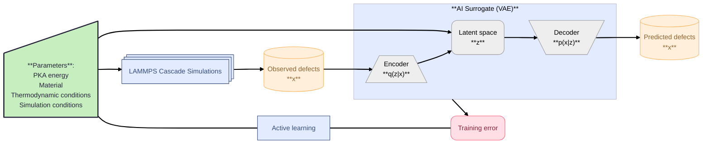

```mermaid
---
config:
  theme: redux
  layout: dagre
---
flowchart LR
 subgraph surrogate["**AI Surrogate (VAE)**"]
        encoder["Encoder
        **q(z|x)**"]
        latent("Latent space
        **z**")
        decoder["Decoder
        **p(x|z)**"]
  end
    parameters["**Parameters**:
    PKA energy
    Material
    Thermodynamic conditions
    Simulation conditions"] --> lammps["LAMMPS Cascade Simulations"] & latent
    lammps --> defects[("Observed defects
    **x**")]
    defects --> encoder
    encoder --> latent
    latent --> decoder
    decoder --> output[("Predicted defects
    **x**")]
    surrogate --> error("Training error")
    learning["Active learning"] ---- error
    parameters --- learning

    encoder@{ shape: trap-b}
    decoder@{ shape: trap-t}
    parameters@{ shape: manual-input}
    lammps@{ shape: procs}
     encoder:::Ash
     latent:::Ash
     decoder:::Ash
     parameters:::Input
     lammps:::Process
     defects:::Data
     output:::Data
     error:::Rose
     learning:::Process
    classDef Input fill:#c6eebf
    classDef Data stroke-width:1px, stroke-dasharray:none, stroke:#FBB35A, fill:#FFEFDB, color:#8F632D
    classDef Process stroke-width:1px, stroke-dasharray:none, stroke:#374D7C, fill:#E2EBFF, color:#374D7C
    classDef Rose stroke-width:1px, stroke-dasharray:none, stroke:#FF5978, fill:#FFDFE5, color:#8E2236
    classDef AI fill:#e4dae7
    classDef Ash stroke-width:1px, stroke-dasharray:none, stroke:#999999, fill:#EEEEEE, color:#000000
    style surrogate fill:#E2EBFF
```
